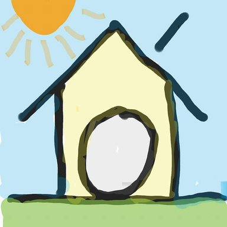

TroTot (Trọ Tốt)
=============

A cross-platform mobile application built with Ionic 2 & Nodejs that connect people who have space to spare with those who are looking for a place to stay (so basically a worse version of airbnb :D)

Also serve as a group project for [Selected Topics on Technology](http://uet.vnu.edu.vn/~tqlong/2017tech/)


Getting started
=============

```
insert commands to run the app
```
To get the app running

```
insert commands to run the api server
```
To get the server running


Group members
=============

1.[Trần Trọng Đạt (co-leader)](https://github.com/trongdat3011)

2.[Chu Viết Hiếu (co-leader)](https://github.com/hieua1)

3.[Bùi Đức Thịnh (co-leader)](https://github.com/thinh2)

4.[Đặng Thái Tuệ (co-leader)](https://github.com/meodorewan)

5.[Đoàn Văn Việt (U L T I M A T E L E A D E R)](https://github.com/vietdoan)


